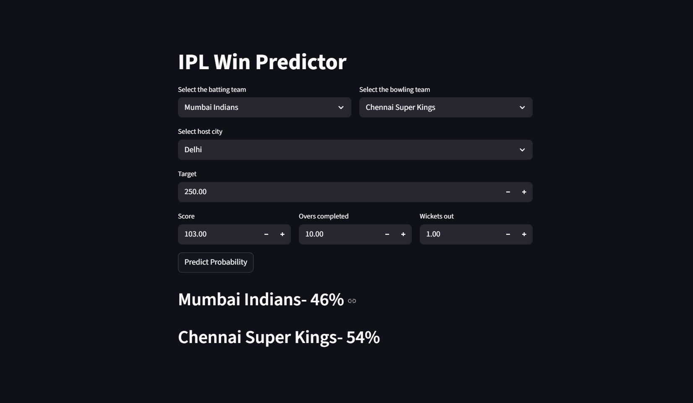

## IPL Win Probability Predictor

This project predicts the winning probability of an IPL team during a live match based on match conditions such as score, overs, wickets, target, venue, and teams.
It uses a machine learning classification model and a streamlit web application for real-time predictions.



## Features

1. Predicts win and loss probability for the batting team
2. Interactive and user-friendly web interface
3. Uses historical IPL match data
4. Real-time probability calculation
5. Deployed using streamlit

### Set Up

1. To get started, first install the dependencies using:
    ```commandline
     pip install -r requirements.txt
    ```
   
2. Run the streamlit app:
   ```commandline
   streamlit run app.py